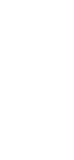

Pametna Kaciga
==============

Pametna kaciga je inovativni projekat razvijen sa ciljem unapređenja bezbednosti i komunikacije u svakodnevnim i rizičnim situacijama. Namenjena je upotrebi u saobraćaju, građevinarstvu i drugim zahtevnim okruženjima.

Za razliku od klasičnih kaciga, ovaj prototip koristi glasovne komande, svetlosnu signalizaciju i vizuelni prikaz informacija, čime omogućava jednostavniju i bezbedniju interakciju bez korišćenja ruku.

Tim i realizacija
-----------------

Projekat su realizovali učenici Elektrotehničke škole „Nikola Tesla” u Nišu: Miloš Živković, Petar Jevtić i Aleksa Ćirić, uz mentorstvo nastavnice Jovane Vučić Šubarević.

Kako funkcioniše
----------------

Sistem je zasnovan na Arduino platformi i koristi kombinaciju elektronskih komponenti za komunikaciju sa korisnikom. Glasovne komande pokreću različite funkcije poput osvetljenja, signalizacije i prikaza statusa na LCD displeju.

Kaciga reaguje na unapred definisane komande kao što su uključivanje, isključivanje i poziv za pomoć, čime omogućava brzu reakciju u kritičnim situacijama.

Glavne komponente
-----------------

*   Arduino Nano mikrokontroler
*   Voice Recognition Module V3
*   LCD displej sa I2C adapterom
*   RGB LED dioda
*   Servo motori
*   Power bank napajanje
*   3D štampani delovi (kućište i dekorativne uši)

Dizajn
------

Kućište i dodatni elementi kacige modelovani su u SolidWorks okruženju i izrađeni pomoću 3D štampe. Poseban vizuelni element predstavljaju „uši” koje služe kao indikator stanja i raspoloženja korisnika.

Primena
-------

### Saobraćaj

Vozači motocikala i bicikala mogu koristiti glasovne komande bez skidanja ruku sa upravljača, čime se povećava bezbednost tokom vožnje.

### Građevinarstvo

Radnici mogu aktivirati svetlosne signale za upozorenje i komunicirati stanje bez dodatne opreme.

### Podrška osobama sa invaliditetom

Kaciga omogućava upravljanje funkcijama putem glasa, bez potrebe za fizičkim interakcijama. LCD displej i signalizacija pružaju dodatnu pomoć u komunikaciji.

### Komunikacija i izražavanje

Vizuelni elementi poput pokretnih „ušiju” i poruka na displeju omogućavaju neverbalnu komunikaciju i izražavanje emocija.

Rezultat
--------

Razvijen je funkcionalan prototip koji uz minimalne resurse uspešno demonstrira ideju pametne kacige. Projekat pokazuje kako kombinacija jednostavnog hardvera i kreativnog pristupa može dovesti do praktičnog rešenja.

Buduća unapređenja
------------------

Planirano je unapređenje sistema korišćenjem ESP32 mikrokontrolera, koji bi omogućio povezivanje na internet, kreiranje web servera i naprednije upravljanje uređajem.

